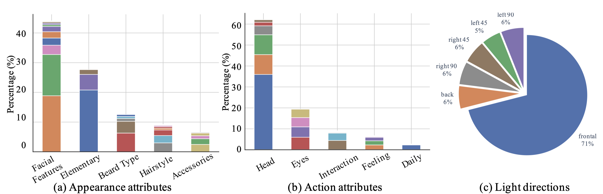
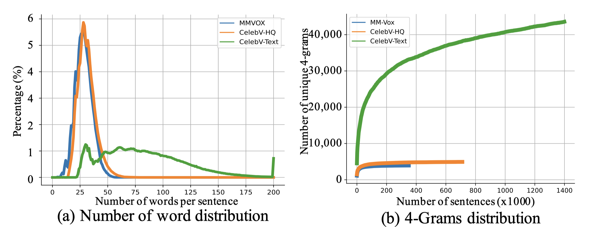
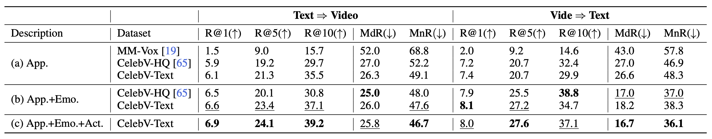

# CelebV-Text: A Large-Scale Facial Text-Video Dataset (CVPR 2023)


**CelebV-HQ: A Large-Scale Video Facial Attributes Dataset**<br>
[Jianhui Yu](https://scholar.google.com/citations?user=sdxlMmMAAAAJ&hl=en)\*,
[Hao Zhu](https://www.zhuhaozh.xyz)\*,
[Liming Jiang](https://liming-jiang.com/),
[Chen Change Loy](https://www.mmlab-ntu.com/person/ccloy/),
[Weidong Cai](https://weidong-tom-cai.github.io/),
and [Wayne Wu](https://wywu.github.io/)
<br>
(*Equal contribution)</small><br>
**[Demo Video](https://www.youtube.com/watch?v=0TS1hQwjNWw)** | **[Project Page](https://celebv-text.github.io/)**
| **[Paper (coming soon)](#)**

> Currently, text-driven generation models are booming in video editing with their compelling
> results.
> However, for the face-centric text-to-video generation, challenges remain severe as a suitable
> dataset with high-quality videos and highly-relevant texts is lacking.
> In this work, we present a large-scale, high-quality, and diverse facial text-video dataset, <b>CelebV-Text</b>,
> to facilitate the research of facial text-to-video generation tasks.
> CelebV-Text contains 70,000 in-the-wild face video clips covering diverse visual content.
> Each video clip is paired with 20 texts generated by the proposed semi-auto text generation
> strategy,
> which is able to describe both the static and dynamic attributes precisely.
> We make comprehensive statistical analysis on videos, texts, and text-video relevance of
> CelebV-Text,
> verifying its superiority over other datasets.
> Also, we conduct extensive self-evaluations to show the effectiveness and potential of
> CelebV-Text.
> Furthermore, a benchmark is constructed with representative methods to standardize the
> evaluation of the facial text-to-video generation task.


## Updates
- [01/01/2023]
    - Code of MMVID-interp is now released [here](https://github.com/celebv-text/MMVID).
    - Pretrained models of benchmarks are released [here](#models). 
    - data annotation file is now released [here](https://drive.google.com/file/d/1JyopDiLcdSZ0tDw2QIvOvwLTaN6rOhEF/view?usp=sharing).
- [28/12/2022]
    - The codebase and project page are created.
    - The download and processing tools for the dataset is released. Use them to construct your CelebV-Text!

## Table of contents

<!--ts-->
   * [Dataset Statistics](#stat)
   * [Agreement](#Agreement)
   * [Dataset Download](#download)
      * [Text Descriptions](#text)
      * [Video Download Pipeline](#videos)
   * [Benchmark](#benchmark)
      * [Baselines](#baselines)
      * [Pretrained Models](#models)
   * [Related Work](#related)
   * [Citation](#citation)
   * [Acknowledgement](#acknowledgement)
<!--te-->


## TODO
- [x] Video download and processing tools.
- [x] Text descriptions.
- [x] Data annotations.
- [x] Code of MMVID-interp.
- [ ] Automatic text generation tool and templates. 
- [x] Pretrained models of benchmarks.


<a name="stat"></a>
## Dataset Statistics
https://user-images.githubusercontent.com/121470971/209757073-77fd707b-e8cc-49ea-8d1d-836bc43d078f.mp4


The distributions of each attribute. CelebV-Text contains <b>70,000 video clips</b> with a total duration of around <b>
279 hours</b>.
Each video is accompanied by <b>20 sentences</b> describing <b>6 designed attributes</b>,
including 40 general appearances, 5 detailed appearances, 6 light conditions, 37 actions, 8 emotions, and 6 light directions.





<a name="Agreement"></a>
## Agreement

- The CelebV-Text dataset is available for non-commercial research purposes only.
- All videos of the CelebV-Text dataset are obtained from the Internet which are not property of our institutions. Our
  institutions are not responsible for the content nor the meaning of these videos.
- You agree not to reproduce, duplicate, copy, sell, trade, resell or exploit for any commercial purposes, any portion
  of the videos and any portion of derived data.
- You agree not to further copy, publish or distribute any portion of the CelebV-Text dataset. Except, for internal use at
  a single site within the same organization it is allowed to make copies of the dataset.


<a name="download"></a>
## Dataset Download


<a name="text"></a>
### (1) Text Descriptions & Metadata Annotation
| Description                         |                                                    Link                                                    |
|:------------------------------------|:----------------------------------------------------------------------------------------------------------:| 
| general & detailed face attributes  |     [Google Drive](https://drive.google.com/file/d/1WBLf0t9EOsuPWmsU4qnFuv_w2dobd-xT/view?usp=sharing)     |
| emotion                             |     [Google Drive](https://drive.google.com/file/d/18V-72aa36r3ZTmu2NHZIMM8aW-0PdKC-/view?usp=sharing)     |
| action                              |     [Google Drive](https://drive.google.com/file/d/1N6Xf2GGstyj--taKnRi5gBd-pXAQX3cI/view?usp=sharing)     | 
| light direction                     |     [Google Drive](https://drive.google.com/file/d/1RwBEBse8Y5aseE7jC4Gu2R177YnpAB8g/view?usp=sharing)     |
| light intensity                     |     [Google Drive](https://drive.google.com/file/d/1o5w2KkXjZi2wygM5z-nL6tWtGGFLcHHO/view?usp=sharing)     |
| light color temperature             |     [Google Drive](https://drive.google.com/file/d/15bcEu6xUtoPZk6kCeYQc01JbKnlt8BFR/view?usp=sharing)     |
| *metadata annotation                |     [Google Drive](https://drive.google.com/file/d/1JyopDiLcdSZ0tDw2QIvOvwLTaN6rOhEF/view?usp=sharing)     |


<a name="videos"></a>
### (2) Video Download Pipeline
Prepare the environment & Run script:

```bash
# prepare the environment
pip install youtube_dl
pip install opencv-python

# you can change the download folder in the code 
python download_and_process.py
``` 

##### JSON File Structure:

```javascript
{
    "clips":
    {
        "0-5BrmyFsYM_0":  // clip 1 
        {
            "ytb_id": "0-5BrmyFsYM",                                        // youtube id
            "duration": {"start_sec": 0.0, "end_sec": 9.64},                // start and end times in the original video
            "bbox": {"top": 0, "bottom": 937, "left": 849, "right": 1872},  // bounding box
            "version": "v0.1"
        },
      
        "00-30GQl0TM_7":  // clip 2 
        {
            "ytb_id": "00-30GQl0TM",                                        // youtube id
            "duration": {"start_frame": 415.29, "end_frame": 420.88},       // start and end times in the original video
            "bbox": {"top": 0, "bottom": 1183, "left": 665, "right": 1956}, // bounding box
            "version": "v0.1"
        },
        "..."
        "..."

    }
}
```

<a name="benchmark"></a>
## Benchmark on Facial Text-to-Video Generation

<a name="baselines"></a>
### (1) Baselines
To train the baselines, we used their original implementations in our paper:
- [MMVID](https://github.com/snap-research/MMVID)
- [TFGAN](https://github.com/minrq/CGAN_Text2Video)


<a name="models"></a>
### (2) Pretrained Models
| Text Descriptions (MMVID)                                   |                                                    Link                                                     |
|-------------------------------------------------------------|:-----------------------------------------------------------------------------------------------------------:|
| VQGAN                                                       |     [Google Drive](https://drive.google.com/file/d/1-b17t6RxUb10weV_xquDANxFyr3DE0k9/view?usp=sharing)      |
| general & detailed face attributes                          |     [Google Drive](https://drive.google.com/file/d/15l0D461-4K2xsdgQNiwjJTxP4xKqZZdV/view?usp=sharing)      |
| emotion                                                     |     [Google Drive](https://drive.google.com/file/d/1cM9xIXSKKjOs5Rhe3e4BCcE4JJAtEy4k/view?usp=sharing)      |
| action                                                      |     [Google Drive](https://drive.google.com/file/d/1aagS0x1kyoAaGIScNkIq0-jy7ArOWpnl/view?usp=sharing)      | 
| light direction                                             |     [Google Drive](https://drive.google.com/file/d/1SMsWOKr7RgkdT6qP8MXnDfZauXmXEycq/view?usp=sharing)      |
| light intensity &  color temperature                        |     [Google Drive](https://drive.google.com/file/d/1SMsWOKr7RgkdT6qP8MXnDfZauXmXEycq/view?usp=sharing)      |
| general face attributes + emotion + action + light direction |     [Google Drive](https://drive.google.com/file/d/1NQtLG9Pnx1DJrgHITU2tAmzOeBVO8OMj/view?usp=sharing)      |


<a name="related"></a>
## More Work May Interest You
There are several our previous publications that might be of interest to you.

* Face Generation:
   * (ECCV 2022) CelebV-HQ: A Large-scale Video Facial Attributes Dataset. Zhu et al. [[Paper](https://arxiv.org/abs/2207.12393)], [[Project Page](https://celebv-hq.github.io)], [[Dataset](https://github.com/celebv-hq/CelebV-HQ)]
   * (CVPR 2022) TransEditor: Transformer-Based Dual-Space GAN for Highly Controllable Facial Editing. Xu et al. [[Paper](https://arxiv.org/abs/2203.17266)], [[Project Page](https://billyxyb.github.io/TransEditor/)], [[Code](https://github.com/BillyXYB/TransEditor)]

* Human Generation:
   * (Tech. Report 2022) 3DHumanGAN: Towards Photo-realistic 3D-Aware Human Image Generation. Yang et al. [[Paper](https://arxiv.org/abs/2212.07378)], [[Project Page](https://3dhumangan.github.io/)], [[Code](https://github.com/3dhumangan/3DHumanGAN)]
   * (ECCV 2022) StyleGAN-Human: A Data-Centric Odyssey of Human. Fu et al.  [[Paper](https://arxiv.org/abs/2204.11823)], [[Project Page](https://stylegan-human.github.io/)], [[Dataset](https://github.com/stylegan-human/StyleGAN-Human)]
   * (SIGGRAPH 2022) Text2Human: Text-Driven Controllable Human Image Generation. Jiang et al. [[Paper](https://arxiv.org/abs/2205.15996)], [[Project Page](https://yumingj.github.io/projects/Text2Human.html)], [[Code](https://github.com/yumingj/Text2Human)]


<a name="citation"></a>
## Citation
If you find this work useful for your research, please consider citing our paper:

```bibtex
@inproceedings{yu2022celebvtext,
  title={{CelebV-Text}: A Large-Scale Facial Text-Video Dataset},
  author={Yu, Jianhui and Zhu, Hao and Jiang, Liming and Loy, Chen Change and Cai, Weidong and Wu, Wayne},
  booktitle={CVPR},
  year={2023}
}
```

<a name="acknowledgement"></a>
## Acknowledgement
CelebV-Text is affiliated with OpenXDLab -- an open platform for X-Dimension high-quality data. This work is supported by NTU NAP, MOE AcRF Tier 1 (2021-T1-001-088).
